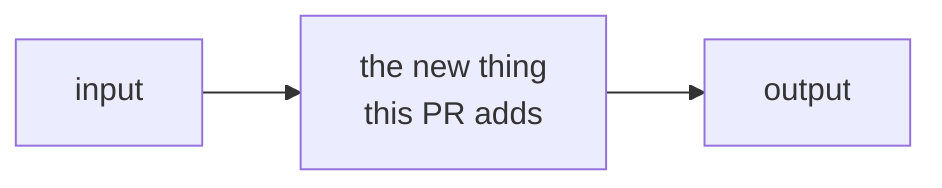

<!-- PR description template — see SKILL.md for the reasoning behind each section.
     Delete comments and any section that would be empty. -->

<!-- Optional: one review-guidance callout. Use for not-for-merge branches, static/generated
     content ("review = spot-check, not code review"), or separability notes. Max one or two. -->
> [!NOTE]
> <!-- e.g. "Large by line count but entirely static snapshots — reviewing this is spot-checking fidelity, not reading code." -->

### Problem

<!-- The need, for a reader outside the immediate work. What is missing/broken and why it
     matters. No solution words here. If "why now?" is a fair question, answer it. -->

### Solution

<!-- Bullets, one idea each, anchored to files/symbols in backticks. Inline a =<15-line
     snippet under a bullet when the API or shape says it better than prose:

- `loader.load_bundle(bundle_dir, task_ids=..., limit=...)` reads `tasks.jsonl` + `samples/*.jsonl`; filenames are pure sharding.
- ...

    ```python
    # the key call site or data shape, trimmed from the real diff — not invented
    ```
-->

### Architecture

<!-- One mermaid diagram max — the structure the reviewer must hold in their head, not the
     whole system. classDiagram = contracts; sequenceDiagram = runtime protocol;
     flowchart = pipeline/composition. Quote all labels; <br/> for line breaks.
     Alternatively (or additionally): one exemplar snippet — a real config, a real output row.
     Rename this heading to fit ("Run pipeline", "How a score is built", "Shape"). -->



<!-- For stacked PRs: one sentence on train position and why.
     "Sits between #N (scorers) and #N+2 (wiring) so the import in `_registry` resolves." -->

### Testing

<!-- The exact command, then what the tests PIN — invariants, counts, regressions.
     Evidence over adjectives. Real output beats description: -->

`<test command>` — NN tests green at this branch: <the invariants pinned, comma-separated>.

<!--
```text
paste real output here when it proves the point (leaderboard rows, error messages, timings)
```
-->

<!-- For PR trains: keep the TOC block current in EVERY PR of the train; pointer on self. -->
<pr-train-toc>

|   | PR | Description |
| --- | --- | --- |
|   | #NNNNN1 | <title> |
| 👉 | #NNNNN2 | <title> (this PR) |
|   | #NNNNN3 | **[combined branch]** <title> |

</pr-train-toc>

---

JIRA: <link-to-jira-ticket>
